# dbx-retail-lakehouse

A hands-on Databricks project focused on retail analytics.

This lab explores:

- SQL-based data exploration
- Notebook-based analytics workflow

The goal is to build practical hands-on experience with Databricks as a user, covering analytics and visualization with SQL.

We will use `backhouse` dataset, which is available in the sample dataset on Databricks.

## Table of Contents
- [dbx-retail-lakehouse](#dbx-retail-lakehouse)
  - [Table of Contents](#table-of-contents)
  - [Create Notebook](#create-notebook)
  - [Visualization](#visualization)
  - [GitHub integration](#github-integration)

---
## Create Notebook

Go to `Workspace`. Select `Notebook` from `Create` pull-down menu.

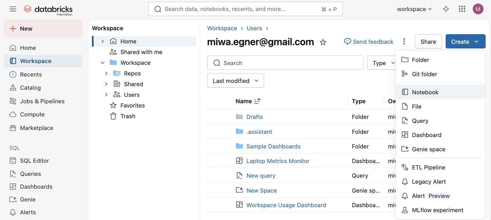

We will get something like this.
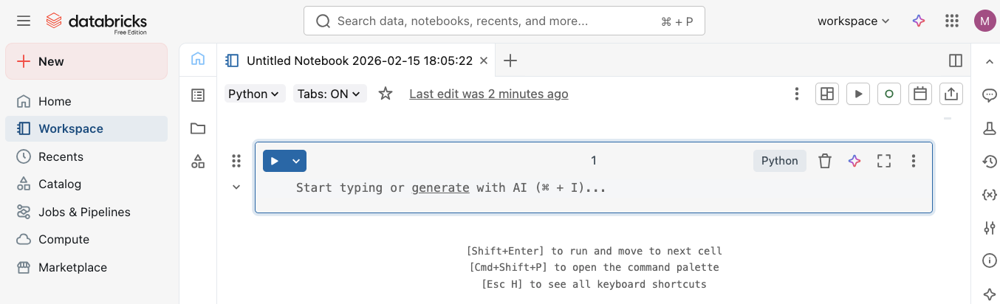

There are two ways to run SQL on Notebook. 
Use magic command `%sql` at the beginning of a cell. 

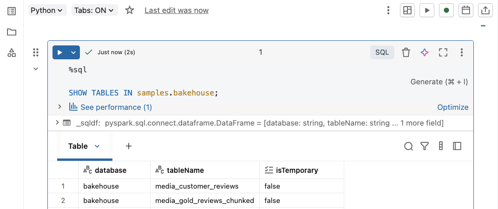

Or change the default language to SQL. 

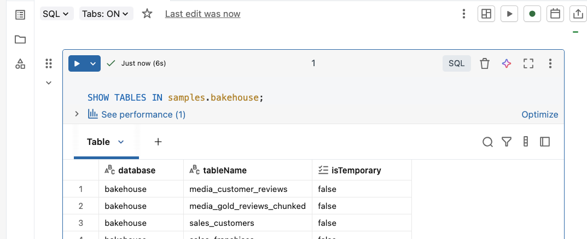

**Tips** To run an SQL command, `Shift` + `Enter` in the cell. We do not need to click on `Run` button every time. 

**Tips** You do not need to keep pressing shift key to write SQL query. Just write everything (like `SELECT` or `FROM`) in lower case, and type `Shift` + `Cmd` + `F` to format the script afterward. 

---
## Visualization

After you create a table with SQL query, click on `+` in the table header, 

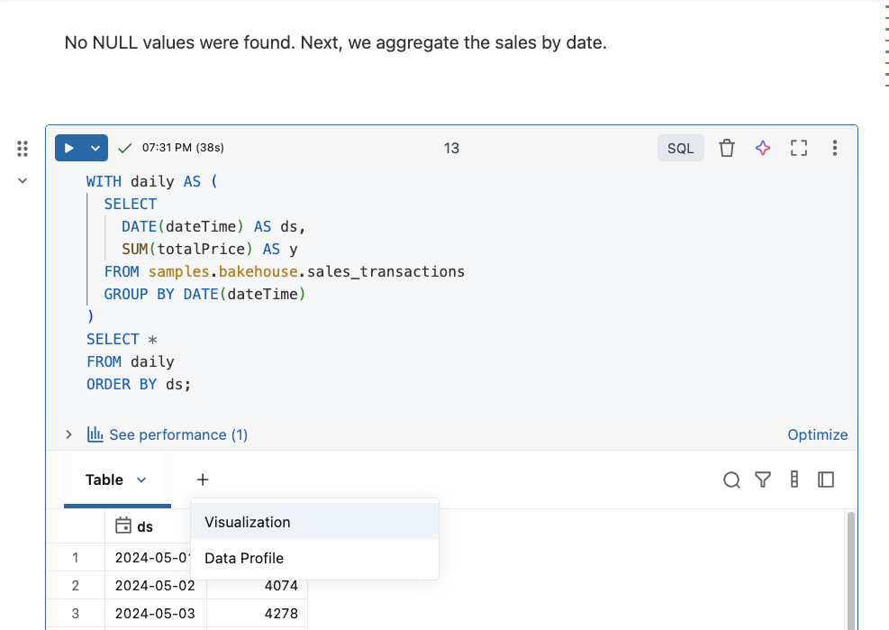

and select `Visualization`. 

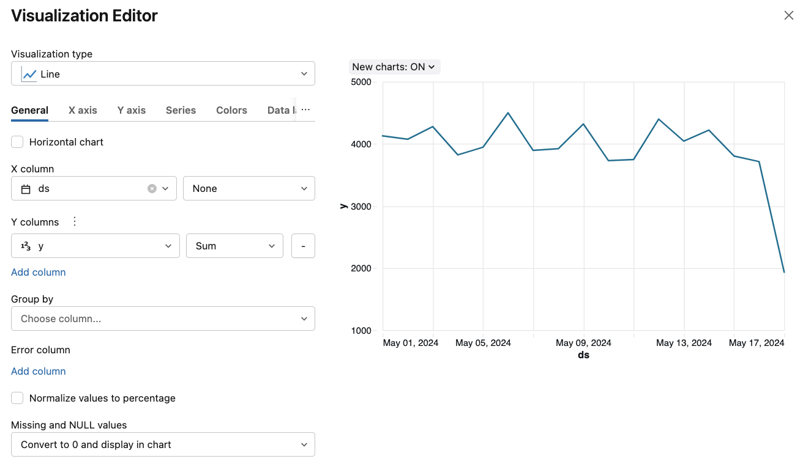

Let us plot the total sum of daily sales over all products over all franchise. 

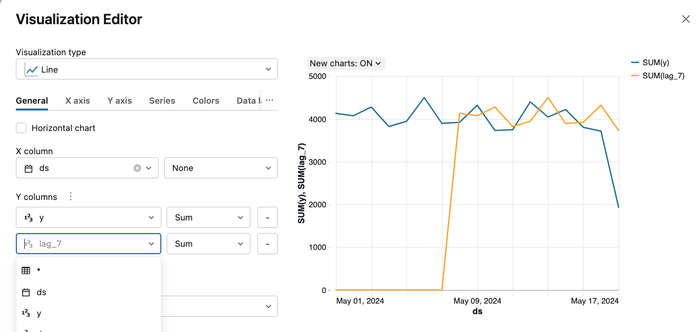

There is no real weekly pattern in the sales.

---
## GitHub integration

We will link the Databricks repo and GitHub repo. 

Go to `Workspace`, and click on `Repos`.

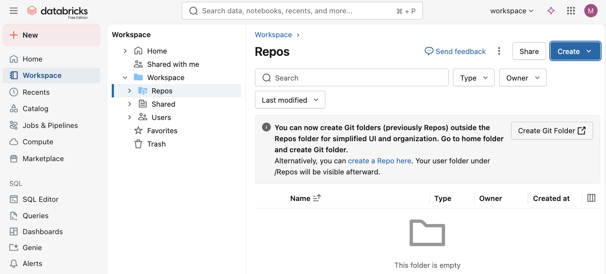

Click on `Create Git Folder`.

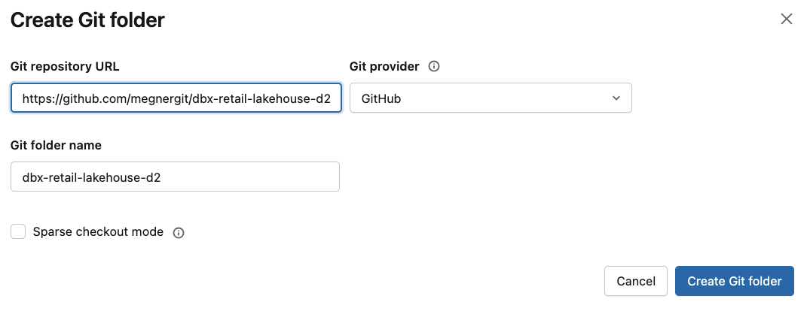

Put the URL of your GitHub repo  (it is okay that the repo is not empty), and click on `Create Git Folder`. 

We will get the following.

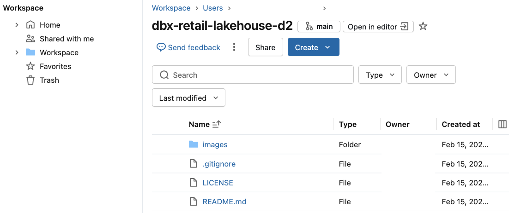

We have to move the notebook that we created above into this folder. 

Just drag and drop the notebook  `01_sql_eda_bakehouse` to the Git folder `dbx-retail-lakehouse-d2`.

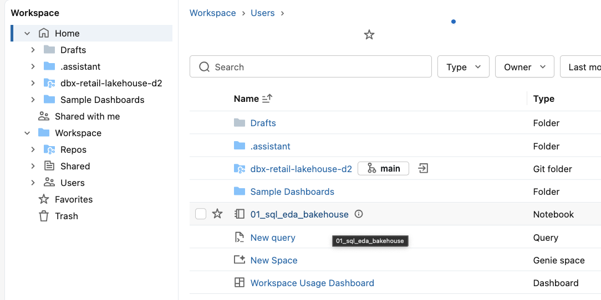

Click on `Main` branch where we will push the notebook. 

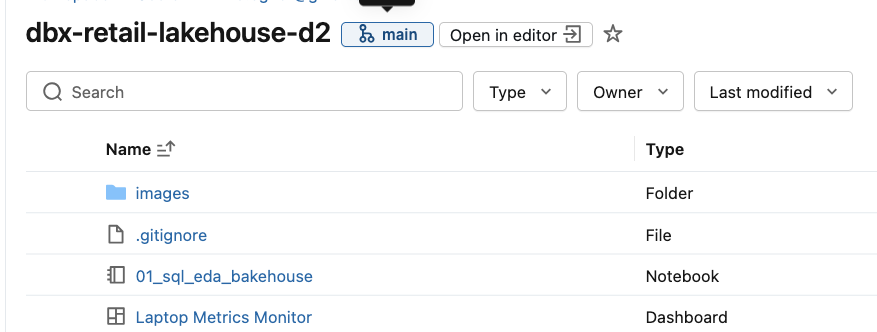

Look at the lower left corner, and fill the commit message. Click on `Commit & Push`. 


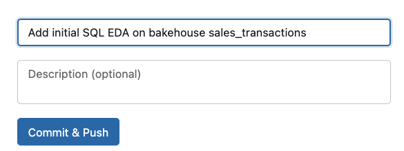

I got `No Git credential...` error. 

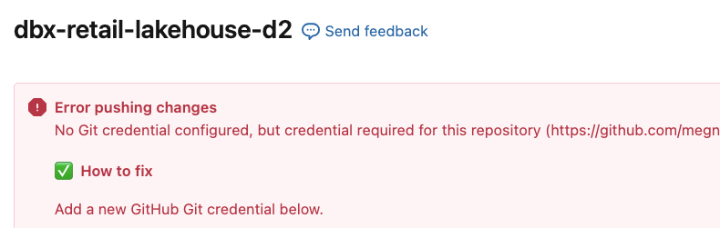

Create a new personal access token (**classic**) at GitHub, and set it at `Git credential`. 

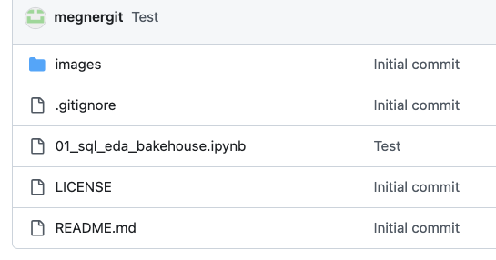

Yes, the notebook is successfully pushed to my GitHub repo.

Let us see if I can still push `README.md` from my laptop. 

We need to rebase the local repo first. 
```sh
$ git pull --rebase origin main

From github.com:megnergit/dbx-retail-lakehouse-d2
 * branch            main       -> FETCH_HEAD
Successfully rebased and updated refs/heads/main.
```

Then, commit and push. 
All right. Successful. 

---


